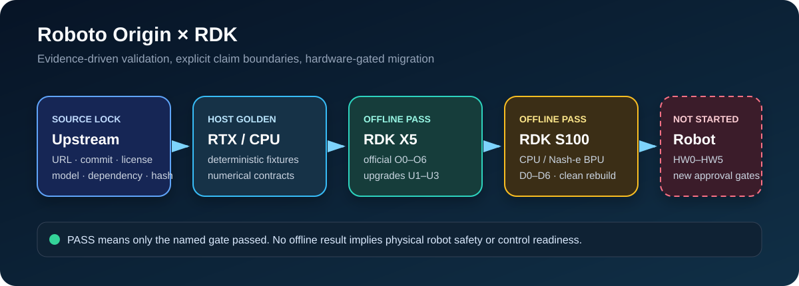

# Roboto Origin × RDK X5 / S100 / S600

[](https://github.com/Xiaomiju-x/roboto-origin-rdk-x5-s100/actions/workflows/ci.yml)
[](LICENSE)
[](https://developer.d-robotics.cc/)
[](https://developer.d-robotics.cc/)
[](https://developer.d-robotics.cc/)

一个面向 [萝博头（Roboto Origin）](https://roboparty.com/roboto_origin/doc) 的、证据驱动的 RDK X5 离线复现、RDK S100 迁移与 RDK S600 算法扩展工程。项目公开可复现的探针、板端脚本、模型/依赖锁、A/B 验收方法和安全门禁；真实机器人接入按 HW0–HW5 分级推进。

> **项目背景：本项目是地瓜机器人（D-Robotics）公司的正式项目，由公司领导牵头推进；本仓库维护者以实习生身份负责其中相关算法研发、离线部署与验证工作。**

> 2026-09-30最新：**团队已验证X5官方行走/舞蹈基础；本项目新增S600外挂算法演示，真实三传感器采集、YOLO11x-Seg、Qwen3-VL-2B和Whisper-medium BPU推理已运行，RTX5090完成浮点/ONNX校验。尚未验收几何融合、现场语音准确率或自主导航，不发送机器人动作。** [S600源码与复现](apps/s600_coprocessor/README.md)。以下早期离线阶段记录保留追溯。

[English](README.en.md) · [结果总览](docs/RESULTS.md) · [复现指南](docs/REPRODUCIBILITY.md) · [安全边界](docs/SAFETY.md) · [路线图](docs/ROADMAP.md)



## 为什么做这个项目

机器人算法“能下载”“能编译”或“能在 PC 上运行”，不等于能在目标板上稳定、准确、安全地工作。本项目把每个结论拆成独立验收门：

- 固定来源、提交、模型、依赖与输入 fixture；
- 分开记录主机、X5 CPU、S100 CPU、S100 BPU、压力与洁净重建结果；
- 用数值 A/B、负输入、超时、残留进程与资源门避免假 PASS；
- 在真实机器人阶段前保持设备隔离和 file-sink/shadow 输出；
- 明确列出未验证项，不用单板结果代替整机结论。

## 已完成

| 目标 | 状态 | 机器证据摘要 |
| --- | --- | --- |
| X5 官方算法离线基线 O0–O6 | PASS | 10/10 ONNX 模型 CPU/CUDA/X5 对照；合成深度、Nav2 规划、FAST-LIO2 回放与 8/8 Isaac 任务闭环 |
| X5 升级 U1：时序占据/流/不确定性 | PASS | 32,286 参数；future occupancy IoU 0.8774；X5 CPU 中位 15.52 ms |
| X5 升级 U2：可信动作守卫 | PASS | 5 类故障 5/5 fail-close；主机/X5 事件与指标一致 |
| X5 升级 U3：KISS-ICP | PASS | 静态零漂移；1.36 m 合成运动终点误差约 0.08 µm |
| S100 D0–D6 单板离线部署 | PASS | 9 个官方模型 BPU PASS、1 个明确 CPU fallback、0 FAIL；4/4 官方视觉 smoke；30 分钟压力；洁净重建 |
| S100 U1 Nash-e BPU A/B | PASS | 128 组、3 输出；平均 cosine 0.999807；BPU p50 0.807 ms |
| YOLO 视觉 shadow：X5→S100→S600 | FUNCTIONAL PASS | X5 原生基线 3/3；S100/S600 YOLO11n 各 10/10；同为 5 检测与 `STOP_CANDIDATE`，严格分数一致性未通过 |
| X5运动底座 + S600外挂 | ALGORITHM PROTOTYPE | 团队已有X5动作；S600三传感器与现代BPU模型已运行，几何导航与现场语音准确率待验 |

完整指标与边界见 [docs/RESULTS.md](docs/RESULTS.md)，S600 迁移过程见 [docs/S600_YOLO11_MIGRATION.md](docs/S600_YOLO11_MIGRATION.md)，脱敏机器摘要见 [evidence/summaries](evidence/summaries)。

## 仓库结构

```text
board/          X5/S100 板端入口说明
config/         平台配置、部署决策与验收合同
docs/           架构、结果、复现、安全与阶段交付文档
evidence/       仅包含脱敏后的机器摘要
inventory/      来源、提交、依赖、模型和能力锁
patches/        针对上游项目的最小可审计补丁
probes/         离线探针与 A/B 工具
requirements/   锁定的板端依赖清单
scripts/host/   主机侧准备、审计、汇总与打包脚本
scripts/board/  X5/S100 板端构建、运行、压力与安全脚本
src/            项目自有算法模块
tests/          不依赖真实设备的单元测试
```

上游仓库、模型、数据集、工具链镜像和原始板端日志不会 vendoring 到本仓库。对应 URL、commit、许可证和哈希记录在 `inventory/` 与 `config/` 中。

## 快速开始

### 1. 本机静态验证

```bash
python -m venv .venv
source .venv/bin/activate
python -m pip install -U pip
python -m pip install -e ".[dev]"
python -m pytest
python scripts/ci/public_release_audit.py
```

Windows PowerShell：

```powershell
py -m venv .venv
.\.venv\Scripts\Activate.ps1
python -m pip install -U pip
python -m pip install -e ".[dev]"
python -m pytest
python scripts/ci/public_release_audit.py
```

### 2. 使用脚本前

先阅读 [复现指南](docs/REPRODUCIBILITY.md) 与目标阶段文档。板端脚本假设项目位于 `/home/sunrise/workspaces/new_project` 下，并要求：

- `ROS_DOMAIN_ID=42`；
- 项目自有端口只使用 `9100–9199` 中的空闲端口；
- 不修改系统 ROS、原 XRD 服务、网络或设备权限；
- 不连接真实执行器，也不发送使能、运动或转矩命令。

脚本并非“一键上车”安装器。每个命令都应在对应门禁、依赖和硬件身份核验后执行。

## 安全门禁

真实机器人阶段按以下顺序推进：

1. **HW0**：无动力物料、电气、线束、急停和身份核对；
2. **HW1**：X5 无运动、只读通信闭环；
3. **HW2**：单执行器、小幅、短时、保守限制动作；
4. **HW3**：传感器与算法 shadow/file-sink 验证；
5. **HW4**：X5 分级闭环与整机验证；
6. **HW5**：以 X5 机器证据为基线做 S100 独立适配。

HW0/HW1 未通过不得给执行器上动力；首次带动力动作、扩大动作范围、恢复冻结服务或接入真实控制通道，都需要现场安全条件与单独授权。详见 [docs/SAFETY.md](docs/SAFETY.md)。

## 公开证据策略

公开仓库保留可复算的指标、哈希、输入合同和脱敏摘要，不公开：

- API Key、Token、密码、私钥或账号材料；
- 私网地址、主机名、MAC、Wi-Fi 信息与个人绝对路径；
- 未获再分发许可的权重、数据集、HBM/BIN、第三方源码或工具链镜像；
- 可能包含设备身份或内部环境信息的原始日志和完整证据包。

公开前检查由 `scripts/ci/public_release_audit.py` 和 CI 自动执行。

## 贡献与维护

问题报告、复现补充与适配 PR 欢迎提交。请先阅读 [CONTRIBUTING.md](CONTRIBUTING.md) 和 [SECURITY.md](SECURITY.md)。所有状态升级都必须附带可复现证据，并明确“通过的门”和“仍未验证的门”。

项目按 [docs/ROADMAP.md](docs/ROADMAP.md) 长期维护。阶段状态、实际改动、证据入口、未通过门与下一步会同步更新。

## 许可与声明

项目自有代码以 [Apache License 2.0](LICENSE) 发布。第三方项目、模型、数据与生成物仍受各自许可证约束，详见 [NOTICE](NOTICE) 和 `inventory/`。

本仓库用于公开上述公司正式项目中由维护者负责的相关算法实现与可复现验证材料；它不将尚未通过的硬件能力或量产状态表述为公司承诺。Roboto Origin、RDK、上游仓库和产品名称的权利归各自权利人所有。
